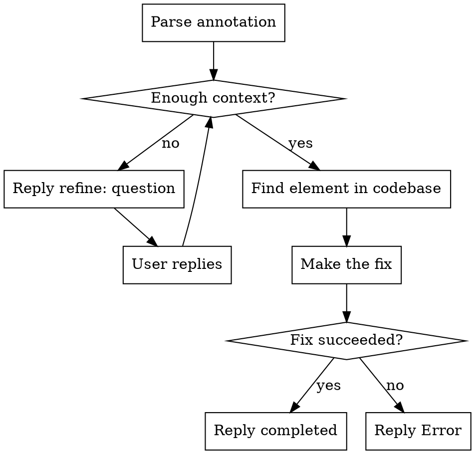

# Fix Me

Handle "Fix Me" annotations sent from the agentation toolbar via fakechat.

## Trigger

A `<channel source="plugin:fakechat:fakechat">` message starting with "Fix me" (case-insensitive).

## Annotation Format

Messages follow this structure:
```
Fix me ## Page Feedback: /path
**Viewport:** WxH

### 1. <ComponentName> element "visible text"
**Location:** .css > .selector > .path
**React:** <ComponentHierarchy>
**Feedback:** what the user wants changed
```

## Response API

Reply to the original message using the fakechat reply tool with `reply_to` set to the annotation's `message_id`. Three response types:

| Response | When | Effect in UI |
|----------|------|-------------|
| `completed` | Fix succeeded | Button pulses green, chat closes |
| `Error` | Fix failed or impossible | Button pulses red, chat closes |
| `refine: <question>` | Need more context | Opens chat panel with your question |

After a `refine:` response, the user replies in the chat. Their reply arrives as a new fakechat message. You can then reply with `completed`, `Error`, or another `refine:`.

## Process



1. **Parse** — Extract element name, location/CSS path, React component, and feedback text
2. **Assess** — Is there enough context to make the fix? If ambiguous (e.g., multiple matching elements), reply `refine: <your question>`
3. **Find** — Use the CSS selector path, React component name, and visible text to locate the element in the codebase
4. **Fix** — Make the requested change. Keep it minimal and scoped to what was asked.
5. **Reply** — `completed` or `Error`

## Rules

- **Responses must be exactly one of the three types.** `completed`, `Error`, or `refine: <message>`. Nothing else.
- **Reply to the original message** using the `reply_to` parameter with the annotation's `message_id`.
- **Scope fixes tightly.** Only change what the annotation asks for. Do not refactor surrounding code.
- **Use refine when ambiguous.** Don't guess if there are multiple matching elements — ask.
- **Build after fixing.** Run `pnpm build` to verify the fix compiles. If it fails, revert and reply `Error`.
